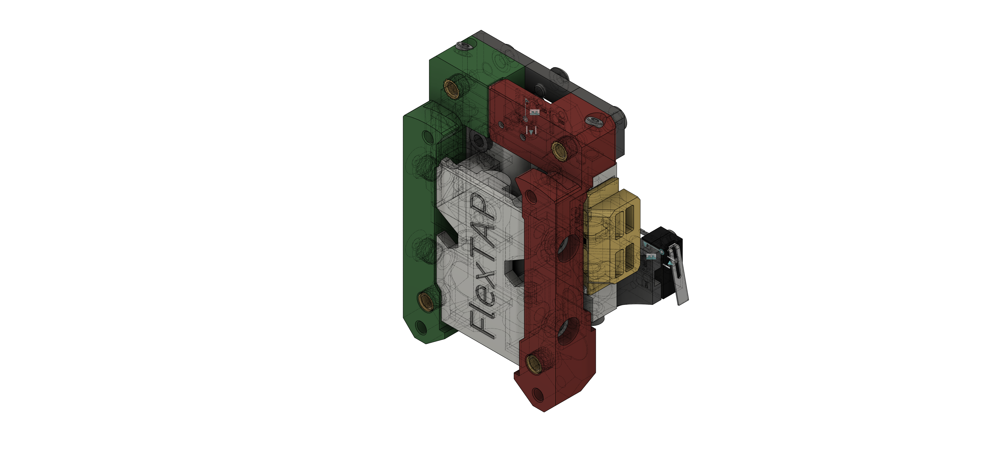

# FlexTAP

This is an experimental flexure based alternative to the Voron TAP for Z probing with the nozzle, compatible with any toolhead that will mount on an R8 TAP.

FlexTAP has two main advantages:
* it's lighter (27 g approx, vs 91 g for an R8 plastic TAP and 76 g for a Mellow CNC alloy TAP)
* it's cheaper. Less hardware involved, no linear rail, no PCB, no magnets.

Vibration behaviour is no worse than other TAP variants, and may be better on some printers.

Actuation force depends on what filament is used to print it, but is sufficiently low not to mar print beds.

Accuracy is very good, on my printers limited by the Z motion system not the probe.

The design also incorporates the rear toolhead board mounting screw position from the XOL carriage for better toolboard stability if using XOL.

This first release is experimental: it works, produces high quality output (the FlexTAP pictured below was printed on a machine fitted with an earlier iteration), but it has not been run for long enough to determine longevity.

# BOM:

* 3x M3x40 screws
* 1x M3x12 or M3x8 for the stop screw (two positions available, different lengths)
* 4x M3x16 FHCS (though any 16mm M3 screw should work)
* 2x M2x8 to mount the microswitch
* 6x standard Voron M3 heatsets
* Omron D2F-01 or D2F-01L (with lever removed) microswitch, wired normally open (the switch is mechanically normally closed, so wire break and misadjustment detection is still available)
* 4x M3x8 to mount to rail carriage
* 2x M3x8 to mount the rear bracket. The bracket provides a center hole compatible with XOL carriage toolhead mounts, but should be installed even if not using that feature.
* 1x M3x8 to mount the endstop bracket, 2x M2x8 to mount the endstop switch, if required
* Toolhead mounting screws

# Printing:

* Use ABS or ASA, the flexures were designed and tested with these materials
* Make sure your profile will handle bridges well and has good layer adhesion
* Do not use fiber-filled filament, all the examples tested were either too stiff or too brittle
* Use standard Voron print settings (0.2 mm layer height, at least 3 perimeters, at least 3 top/bottom layers or a shell thickness of 0.8 mm, 45% cubic infill)
* Support for the core is included, STLs are in print orientation
* Print and install the XOL bracket even if you will not be using the center screw, it also adds significant rigidity.
* The X endstop bracket is only necessary if you need to mount an endstop microswitch

FlexTAP is not an especially difficult print, if you can print a StealthBurner front section or an R8 Voron TAP, this should present no particular problem.

# Assembly:

See the CAD image and photos. I recommend attaching the three parts together using the four FHCS, then installing the stop screw, and only then installing the heatsets. One M3x40 goes up from the bottom of the center part, and actuates the switch; this screw may be hard to drive in, I use a power driver. The inner stop screw location is more robust, but will usually be hard to access with a toolhead installed; the outer one can be accessed directly with a ball driver on either a XOL or Stealthburner without dismounting any parts.

FlexTAP uses Archetype V1 belt clips. These are installed with the open side facing the rail. Belt enters the slot closest to the rail, is folded back on itself and exits through the same slot, forming a loop around the screw once installed and locking into the the belt's own teeth. The other slot is for retaining the loose end of the belt if necessary.

# Adjustment:

Before installation, adjust the center screw so it just barely actuates the switch, verify that the switch can be clicked on and will switch off on its own by pulling the lower belt clamp tabs downward. If the switch does not turn off on its own, advance the center screw by about 1/12 turn. Then adjust the stop screw to actuate the switch, then back it off till the switch deactivates and verify that the switch still works as described.

Repeat the adjustment after installing the belt clamps and tensioning the belts but before installing the toolhead (this time pushing the front of the TAP upward).

Once the toolhead is installed and TAP configured, verify correct endstop operation before attempting to home.

The mechanism takes a number of probes to settle, so it's a good idea to run probe_accuracy tests with a total of at least 50 probes before proceeding. Then set Z offset by your favourite method and it should be good to go.

# Acknowledgements:

@zruncho and @chirpy for picking up and running with it, @esoterical for useful discussion, @frix_x for saying "Finally!" when I first mentioned the idea.
